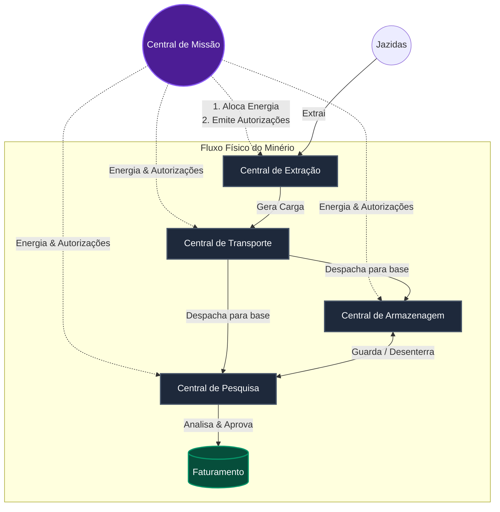
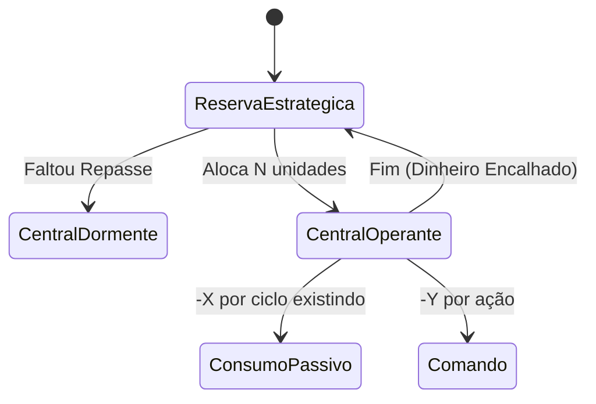
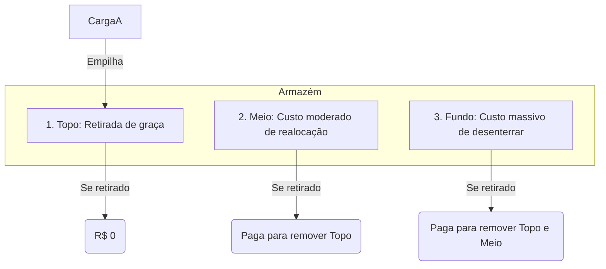

# Operação Marte: Manual do Desenvolvedor

Bem-vindo à Operação Marte! Seu objetivo como desenvolvedor é construir um sistema autônomo capaz de orquestrar cinco centrais especializadas para maximizar o faturamento extraindo, transportando, armazenando, analisando e distribuindo minerais marcianos.

O mundo em que seu código opera roda em um **motor de simulação discreto (em ciclos)**. Seus algoritmos consumirão eventos reais e responderão com comandos via API. Mas cuidado: cada ação custa energia, cada ciclo parado corrói o valor da sua carga, e falhar em desenhar boas estratégias fará a sua operação entrar em falência antes do previsto.

Abaixo estão as especificações táticas de cada frente para você construir a inteligência da sua operação.

---

## 1. Arquitetura e Fluxo de Dependências

O fluxo do mineral desde a terra até o faturamento não é linear. Para operar o ciclo completo, suas centrais precisarão conversar umas com as outras através do compartilhamento do estado (recebido nos webhooks).

---

## 2. As Frentes de Operação

Cada central tem regras rígidas, limites e trade-offs. 

### 📡 Central de Missão (Alocação de Recursos)
É o coração administrativo. Ela detém a reserva estratégica de energia e precisa distribuí-la para as outras centrais manterem as luzes acesas e realizarem ações. Também é ela quem gera as autorizações de segurança para transações sensíveis (como mover carga e distribuir).

* **O que permite:** Alocar energia para outras centrais com políticas de repasse distintas; solicitar autorizações com classes diferentes.
* **Vantagem:** Visão do todo. Se a extração quebrou, a missão pode cortar o envio de energia para não desperdiçar recursos.
* **Desvantagens/Cuidados:**
  * Energia alocada para uma central **não volta mais**. Se enviar 500 para Extração e ela não usar, a energia encalha.
  * Autorizações custam energia e **são consumidas no primeiro uso**.
  * A própria Missão é a única central irrecuperável: se ela secar, ninguém mais pode alocar energia e o mundo encerra.
* **Escolhas estratégicas novas:**
  * **Classes de autorização:** `rapida` (barata), `segura` (cara) ou `lote` (muito cara, várias operações). Quanto mais cara, maior o custo administrativo, mas menor o risco de reprocessamento.
  * **Políticas de repasse:** `pulso` (envia tudo pedido) ou `contingencia` (mantém um colchão mínimo na Missão, preservando a capacidade de alocar no futuro). Contingência não se aplica quando o destino é a própria Missão: repor a si mesma nunca é limitado.

---

### ⛏️ Central de Extração
A base da cadeia produtiva. Gerencia unidades mineradoras operando em jazidas espalhadas no mapa.

* **O que permite:** Enviar robôs para extrair minerais, definindo a quantidade, o **modo de operação** (cuidadoso, normal, agressivo), o **tipo de mineradora** e o **perfil de escavação**.
* **Vantagem:** Você dita a velocidade em que a riqueza entra no sistema.
* **Desvantagens/Cuidados:**
  * Minerar desgasta os robôs. Desgaste alto encarece cada operação seguinte.
  * Minerar sob "modo agressivo" é muito mais rápido, porém multiplica o dano ao equipamento e a degradação estrutural em que a carga nasce.
  * Cada mineradora tem capacidade máxima própria; excedê-la gera `operacao_invalida`.
* **Escolhas estratégicas novas:**
  * **Tipos de mineradora:** `leve` (rápida, barata, 35 de capacidade) ou `precisa` (mais lenta, preserva mais qualidade, 25 de capacidade). Casar o robô com a jazida e o mineral é uma decisão econômica real.
  * **Perfis de escavação:** `superficial` (padrão), `profunda` (+25% energia, +4 de qualidade), `mapeadora` (+10% energia, +2 de qualidade).
* **Mecânica a contornar:** A degradação contínua e o conserto. A extração exige que você decida quando correr riscos (para minerais valiosos ou jazidas arriscadas) e quando agir seguro. O desafio é implementar o controle de **Desgaste e Modos de Falha**, trocando de robôs enquanto outros esfriam na base.

---

### 🚜 Central de Transporte
Move o mineral da jazida para a base onde ficam o Armazém e a Pesquisa.

* **O que permite:** Despachar transportadoras com a carga recém-extraída usando **modos de condução** (econômico, normal, rápido) e escolhendo entre **rotas fixas e variantes** com perfis distintos.
* **Vantagem:** Modo rápido e rotas especializadas podem cortar drasticamente a degradação em minerais valiosos.
* **Desvantagens/Cuidados:**
  * Transportadoras só possuem um número X de "viagens" antes de sofrerem manutenção.
  * Cargas valiosas ou raras sofrem muito mais degradação por ciclo durante a viagem por causa da raridade.
  * A qualidade exata da carga continua oculta antes da análise, então a decisão de transporte é feita sob incerteza.
  * A transportadora também tem limite de capacidade; a rota não contorna esse limite.
* **Escolhas estratégicas novas — malha híbrida de 20 rotas:**
  * `10 rotas fixas`: equilibradas e previsíveis, uma por setor. Linha de base de custo, tempo e preservação.
  * `10 rotas variantes`: sorteadas por seed a partir de perfis com trade-offs econômicos distintos e próprios atributos (`custo_energia_base`, `multiplicador_degradacao`, `multiplicador_desgaste`, `capacidade_maxima`).
  * **Perfis variantes implementados:**
    * `blindada`: preserva qualidade, custa mais energia, capacidade menor
    * `economica`: baixo custo energético, degrada mais a carga
    * `turbo`: chega rápido, desgasta mais a transportadora
    * `pesada`: alta capacidade, mais energia e degradação
    * `tecnica`: minimiza degradação, castiga fortemente o robô
    * `abrasiva`: curta e barata, muita perda de qualidade
    * `panoramica`: poupa o robô, preserva razoavelmente, mas é lenta
    * `corredor_frio`: boa para material sensível, energia acima da média
    * `manutencao_leve`: reduz desgaste acumulado, viagem mais lenta
    * `expressa_fragil`: muito rápida, capacidade baixa e alta degradação
  * `GET /transporte/planejar-transporte` já filtra automaticamente rotas sem capacidade para a carga.
* **Mecânica a contornar:** Não há transporte genérico. O desenvolvedor precisa implementar um algoritmo de roteamento que combine **mineral, rota, modo de condução e estado da transportadora** para decidir: **"Essa carga vale o custo desta rota neste modo?"**

---

### 📦 Central de Armazenagem
O pulmão da operação. Minérios "na mão" degradam muito rápido (pois estão expostos ao clima marciano). O Armazém estabiliza isso.

* **O que permite:** Receber, estocar e retirar minérios. A estrutura física é uma **Pilha estrita (LIFO - Last In, First Out)**. Ou seja, o último que você colocou é o primeiro que sai de graça.
* **Vantagem:** Interrompe severamente o decaimento de qualidade do material.
* **Desvantagens/Cuidados:**
  * **Custa caro desorganizar.** Desempilhar um mineral que está no fundo do armazém cobra energia por cada caixa que precisou ser removida do caminho, e gasta os movimentos de realocação.
  * Manutenção do armazém cobra por ocupação no fim de cada ciclo.
  * **Só aceita carga que já passou por transporte.** Cargas em `EM_JAZIDA` ou `EM_TRANSITO` são rejeitadas com `operacao_invalida`. A armazenagem é buffer, não atalho logístico.
* **Mecânica a contornar:** Dominância de posicionamento. Você não deve usar a API como apenas um banco de dados CRUD, ou a operação vai à falência pagando multas de rearranjo. O desafio é **ordenar e antever**. É preciso avaliar não o que é mais caro, mas sim *o que estraga primeiro*, criando estratégias inteligentes de quem fica no fundo e quem fica no topo da pilha.

---

### 🔬 Central de Pesquisa
O funil e gargalo estratégico da operação. É o único local com equipamento capaz de aferir a real pureza do mineral e autorizar sua venda.

* **O que permite:** Iniciar análises com tipos distintos, classificar a qualidade de cargas já analisadas, sondar jazidas para revelar uma **estimativa de composição em faixas**, aprovar com políticas diferentes e distribuir cargas aprovadas para transformar o ativo em faturamento.
* **Vantagem:** Sem ela, a operação inteira trabalha "às cegas". Uma carga não analisada não informa qualidade em nenhuma outra central, e uma carga não aprovada não pode ser vendida.
* **Desvantagens/Cuidados:**
  * Só consegue processar **UM pedido por vez**. Ocupar a máquina rejeitará novas chamadas.
  * O tempo de análise varia por mineral e pelo tipo de análise escolhido.
  * A sondagem não revela percentuais exatos: ela devolve faixas como `tracos`, `baixa`, `media` e `alta` por mineral.
  * Sondar uma jazida disputa o mesmo gargalo das análises de carga.
* **Escolhas estratégicas novas:**
  * **Tipos de análise:** `rapida` (metade da duração, 80% do custo), `completa` (padrão) ou `forense` (50% mais longa, 140% do custo). A rápida libera caixa antes; a completa é o equilíbrio; a forense custa mais mas pode justificar-se em minerais raros.
  * **Políticas de aprovação:** `comercial` (limiar 40), `estrita` (limiar 70) ou `premium` (limiar 85). Material degradado que passaria na comercial pode ser barrado na estrita. A escolha da política afeta diretamente o volume de cargas que chegam ao faturamento.
* **Mecânica a contornar:** Assimetria de Informação e Sistemas de Fila. Uma vez que o laboratório processa apenas um volume por vez e cada um leva um tempo diferente, novas cargas de transporte vão chegar o tempo inteiro. Na "mão", elas apodrecem.
  Seu sistema precisará **implementar e gerenciar sua própria fila de prioridade inteligente**, ponderando quando vale a pena liberar faturamento agora e quando vale gastar ciclos para sondar uma jazida e melhorar as próximas decisões de transporte.

---

## 3. Dinâmica Geral de Ações e Trade-offs

1. **A Degradação é a principal inimiga:** Tempo é literalmente dinheiro. Minerais tem qualidade de 0 a 100. Um material vendido a 100% vale 100% do faturamento. Se degradou e caiu para 50%, você acabou de perder metade do dinheiro. Cada segundo parado numa doca entre uma API e outra, o multiplicador come sua carga. 
2. **Cuidado com Eventos Paralelos:** Como o Motor roda assincronamente por ciclos, não assuma processamentos síncronos da API. Envie o comando, espere o webhook do evento de sucesso (`analise_concluida`, `carga_entregue`), e só então direcione suas rotinas.
3. **Erros são engolidos pelo custo operacional:** Mandar um comando com ID inválido ou parâmetros contra a regra de negócio não vai "travar" o mundo com exceção, mas vai gerar um evento de `operacao_invalida` e vai custar a energia gasta no ciclo sem te devolver nada. Lide com as condicionais com perfeição localmente.

**Boa Sorte, Operador.**
O mundo não perdoa código imperativo ineficiente. Construa sistemas inteligentes.
