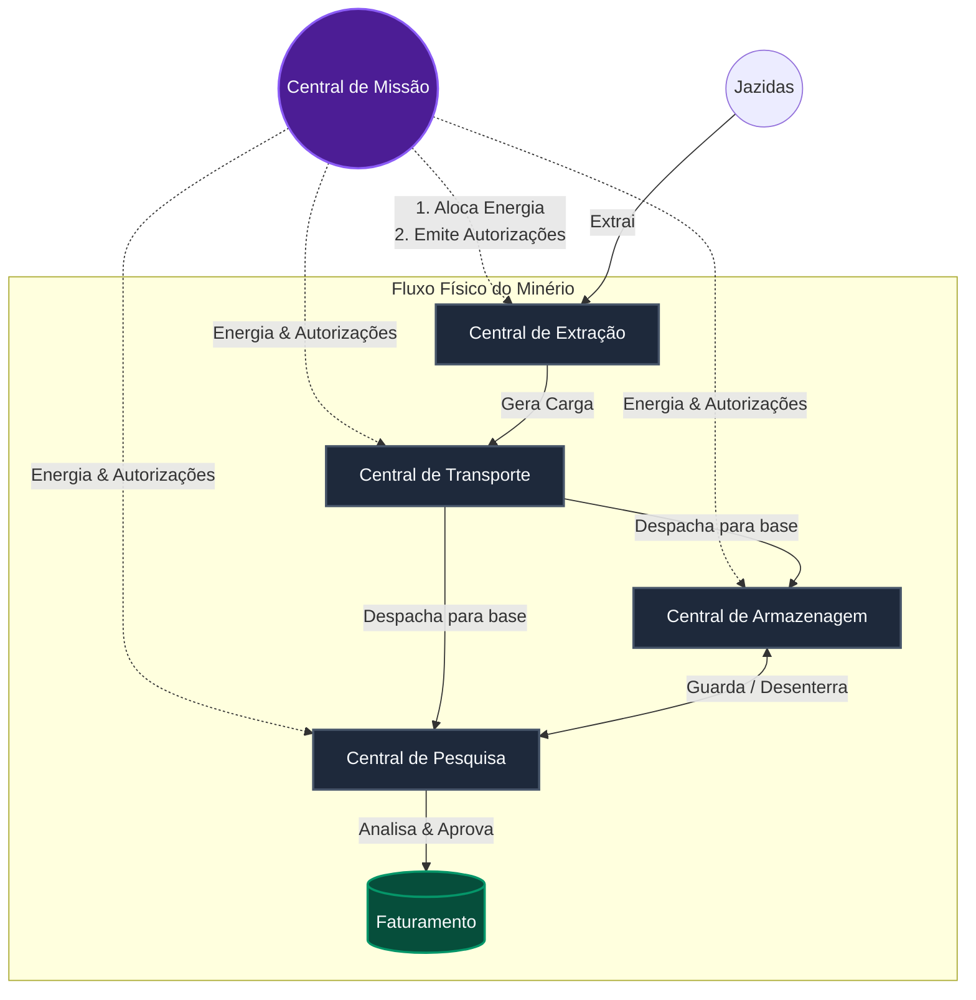
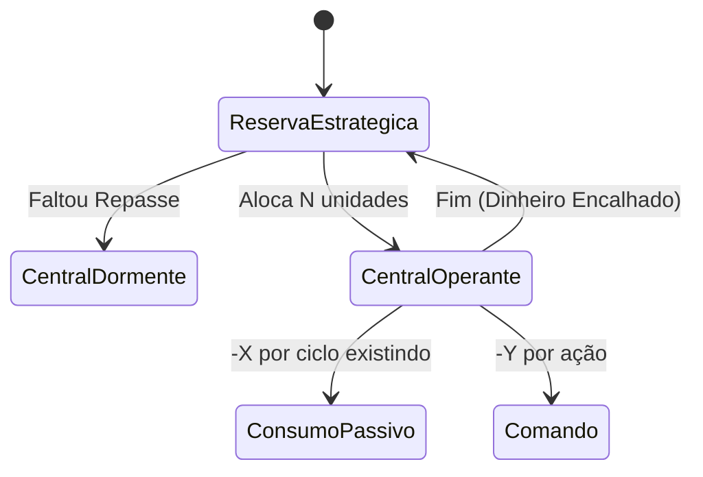
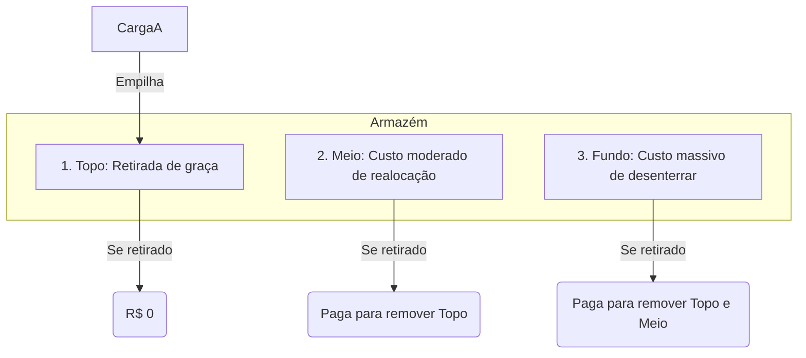

# Operação Marte: Manual do Desenvolvedor

Bem-vindo à Operação Marte! Seu objetivo como desenvolvedor é construir um sistema autônomo capaz de orquestrar cinco centrais especializadas para maximizar o faturamento extraindo, transportando, armazenando, analisando e distribuindo minerais marcianos.

O mundo em que seu código opera roda em um **motor de simulação discreto (em ciclos)**. Seus algoritmos consumirão eventos reais e responderão com comandos via API. Mas cuidado: cada ação custa energia, cada ciclo parado corrói o valor da sua carga, e falhar em desenhar boas estratégias fará a sua operação entrar em falência antes do previsto.

Abaixo estão as especificações táticas de cada frente para você construir a inteligência da sua operação.

---

## 1. Arquitetura e Fluxo de Dependências

O fluxo do mineral desde a terra até o faturamento não é linear. Para operar o ciclo completo, suas centrais precisarão conversar umas com as outras através do compartilhamento do estado (recebido nos webhooks).

---

## 2. As Frentes de Operação

Cada central tem regras rígidas, limites e trade-offs. 

### 📡 Central de Missão (Alocação de Recursos)
É o coração administrativo. Ela detém a reserva estratégica de energia e precisa distribuí-la para as outras centrais manterem as luzes acesas e realizarem ações. Também é ela quem gera as autorizações de segurança para transações sensíveis (como mover carga e distribuir).

* **O que permite:** Alocar energia emotes para outras centrais; solicitar autorizações.
* **Vantagem:** Visão do todo. Se a extração quebrou, a missão pode cortar o envio de energia para não desperdiçar recursos.
* **Desvantagens/Cuidados:**
  * Energia alocada para uma central **não volta mais**. Se enviar 500 para Extração e ela não usar, a energia encalha.
  * Autorizações custam energia e **expiram** se não forem usadas a tempo.
* **Mecânica a contornar:** O esgotamento. Se alguma frente ficar sem saldo, ela entra em estado "dormente" e não processa nada. O desafio aqui é implementar um **scheduling financeiro** contínuo e preventivo.

---

### ⛏️ Central de Extração
A base da cadeia produtiva. Gerencia unidades mineradoras operando em jazidas espalhadas no mapa.

* **O que permite:** Enviar robôs para extrair minerais, definindo a quantidade e o **modo de operação** (Conservador, Equilíbrio, Agressivo).
* **Vantagem:** Você dita a velocidade em que a riqueza entra no sistema.
* **Desvantagens/Cuidados:**
  * Minerar desgasta os robôs. Se chegarem em desgaste limite, eles quebram.
  * Minerar sob "modo agressivo" é muito mais rápido, porém multiplica o dano ao equipamento e a taxa de degradação estrutural em que a carga nasce.
* **Mecânica a contornar:** A degradação contínua e o conserto. A extração exige que você decida quando correr riscos (para minerais valiosos ou jazidas arriscadas) e quando agir seguro. O desafio é implementar o controle de **Desgaste e Modos de Falha**, trocando de robôs enquanto outros esfriam na base.

---

### 🚜 Central de Transporte
Move o mineral da jazida para a base onde ficam o Armazém e a Pesquisa.

* **O que permite:** Despachar transportadoras com a carga recém-extraída definindo também **modos de condução** (Econômico, Padrão, Urgente).
* **Vantagem:** O modo Urgente pode cortar o tempo de viagem drasticamente.
* **Desvantagens/Cuidados:**
  * Transportadoras só possuem um número X de "viagens" antes de sofrerem manutenção. 
  * Cargas valiosas ou raras sofrem muito mais degradação por ciclo fora de áreas seguras.
  * O modo de condução Econômico salva energia e robôs, mas o tempo extra corrói o valor do minério raro.
  * A qualidade exata da carga continua oculta antes da análise, então a decisão de transporte ainda é feita sob incerteza.
* **Mecânica a contornar:** Não há transporte genérico. O desenvolvedor precisa implementar um algoritmo de roteamento que saiba ler a carga que está aguardando e combinar isso com a **estimativa de composição da jazida de origem** para decidir: **"Esse minério compensa o custo extremo do transporte expresso?"**

---

### 📦 Central de Armazenagem
O pulmão da operação. Minérios "na mão" degradam muito rápido (pois estão expostos ao clima marciano). O Armazém estabiliza isso.

* **O que permite:** Receber, estocar e retirar minérios. A estrutura física é uma **Pilha estrita (LIFO - Last In, First Out)**. Ou seja, o último que você colocou é o primeiro que sai de graça.
* **Vantagem:** Interrompe severamente o decaimento de qualidade do material.
* **Desvantagens/Cuidados:**
  * **Custa caro desorganizar.** Desempilhar um mineral que está no fundo do armazém cobra energia por cada caixa que precisou ser removida do caminho, e gasta os movimentos de realocação.
  * Manutenção do armazém cobra por ocupação no fim de cada ciclo.
* **Mecânica a contornar:** Dominância de posicionamento. Você não deve usar a API como apenas um banco de dados CRUD, ou a operação vai à falência pagando multas de rearranjo. O desafio é **ordenar e antever**. É preciso avaliar não o que é mais caro, mas sim *o que estraga primeiro*, criando estratégias inteligentes de quem fica no fundo e quem fica no topo da pilha.

---

### 🔬 Central de Pesquisa
O funil e gargalo estratégico da operação. É o único local com equipamento capaz de aferir a real pureza do mineral e autorizar sua venda.

* **O que permite:** Iniciar análises, classificar a qualidade de cargas já analisadas, sondar jazidas para revelar uma **estimativa de composição em faixas**, e distribuir cargas aprovadas para transformar o ativo em faturamento no sistema.
* **Vantagem:** Sem ela, a operação inteira trabalha "às cegas". Uma carga não analisada não informa qualidade em nenhuma outra central e não pode ser vendida.
* **Desvantagens/Cuidados:**
  * Só consegue processar **UM pedido por vez**. Ocupar a máquina rejeitará novas chamadas.
  * O tempo de análise varia por mineral. Analisar um Cristal Raro leva vários ciclos a mais do que investigar Areia.
  * A sondagem não revela percentuais exatos: ela devolve faixas como `tracos`, `baixa`, `media` e `alta` por mineral.
  * Sondar uma jazida disputa o mesmo gargalo das análises de carga.
* **Mecânica a contornar:** Assimetria de Informação e Sistemas de Fila. Uma vez que o laboratório processa apenas um volume por vez e cada um leva um tempo diferente, novas cargas de transporte vão chegar o tempo inteiro. Na "mão", elas apodrecem.
  Seu sistema precisará **implementar e gerenciar sua própria fila de prioridade inteligente**, ponderando quando vale a pena liberar faturamento agora e quando vale gastar ciclos para sondar uma jazida e melhorar as próximas decisões de transporte.

---

## 3. Dinâmica Geral de Ações e Trade-offs

1. **A Degradação é a principal inimiga:** Tempo é literalmente dinheiro. Minerais tem qualidade de 0 a 100. Um material vendido a 100% vale 100% do faturamento. Se degradou e caiu para 50%, você acabou de perder metade do dinheiro. Cada segundo parado numa doca entre uma API e outra, o multiplicador come sua carga. 
2. **Cuidado com Eventos Paralelos:** Como o Motor roda assincronamente por ciclos, não assuma processamentos síncronos da API. Envie o comando, espere o webhook do evento de sucesso (`analise_concluida`, `carga_entregue`), e só então direcione suas rotinas.
3. **Erros são engolidos pelo custo operacional:** Mandar um comando com ID inválido ou parâmetros contra a regra de negócio não vai "travar" o mundo com exceção, mas vai gerar um evento de `operacao_invalida` e vai custar a energia gasta no ciclo sem te devolver nada. Lide com as condicionais com perfeição localmente.

**Boa Sorte, Operador.**
O mundo não perdoa código imperativo ineficiente. Construa sistemas inteligentes.
